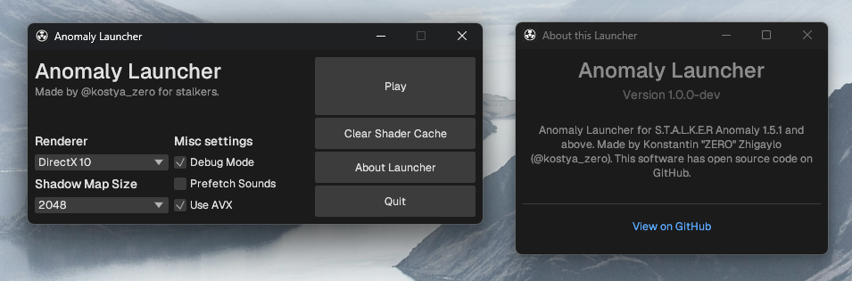

# Anomaly Launcher

Anomaly Launcher is a launcher for S.T.A.L.K.E.R Anomaly 1.5.1 and above.
The primary objective of this project is to offer a swift and fresh launcher with useful features.

## Installation

1. Download the desired version of the launcher from the [releases page](https://github.com/kostya-zero/AnomalyLauncher/releases).
2. Extract the contents of the downloaded archive.
3. Rename the original launcher (e.g., `AnomalyLauncherOld.exe`) or remove it entirely.
4. Place the extracted executable files in the root of the game folder.

## Troubleshooting

If you encounter any issues while using Anomaly Launcher, please follow these steps:

1. Ensure that executable file is not damaged by running it via terminal.
2. Make sure that you have installed the latest Visual C++ Redistributables on your system.

If the problem persists, report it by creating an issue on our GitHub repository:

1. Go to the [Issues page](https://github.com/kostya-zero/AnomalyLauncher/issues).
2. Click on the "New issue" button.
3. Provide a detailed description of the problem, including any error messages and steps to reproduce the issue.
